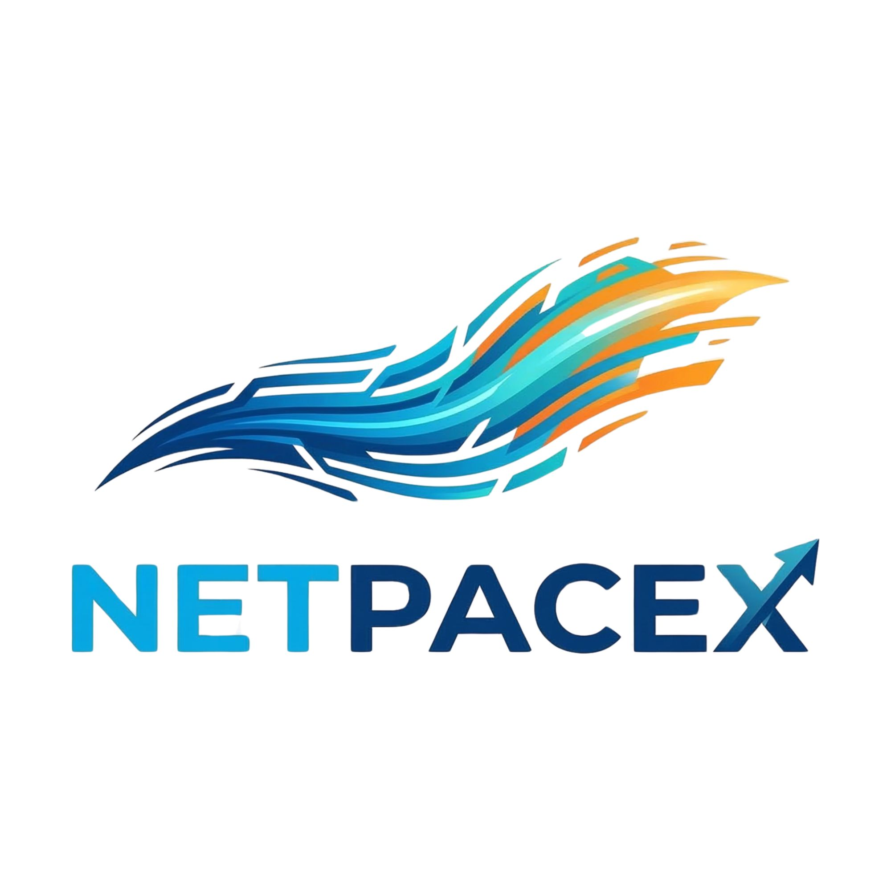

<p align="center">
  
</p>

<h1 align="center">NetPaceX ⚡️</h1>

<p align="center">
  
  
  
  
  
  
  
</p>

NetPaceX is a lightweight, zero-telemetry network speed testing application optimized for home servers. It is specifically designed to bypass network-wide adblockers and firewalls (such as Pi-hole or OPNsense) that frequently block commercial speed test trackers.

NetPaceX measures connection speed from your home server to the external internet (WAN). Tests run directly from the Go backend to **Cloudflare**, **M-Lab (NDT7)**, or **Ookla** servers, ensuring immunity to frontend DNS blocking. **M-Lab tests feature automatic server location discovery (City, Country), and the dashboard renders three premium diagnostic charts in real-time.**

**This version features official integrated logo, favicon, and M-Lab location discovery.**

## 🚀 Key Features

### Performance & Testing
- **Multi-Engine Support**: Direct integration with **Cloudflare**, **M-Lab (NDT7)**, and **Ookla** speed test engines.
- **Intelligent Discovery**: Automatic geographic location identification for M-Lab servers.
- **Automated Scheduling**: Configurable automated testing via standard Cron expressions.
- **Comprehensive Metrics**: Real-time tracking of Download, Upload, **Jitter**, and Ping (Min/Max/Avg).

### User Interface & Experience
- **Modern Architecture**: Fully modularized codebase with a Go-powered backend and an ES6 module-based frontend.
- **Premium Design**: Dependency-free Vanilla TypeScript/CSS frontend featuring a high-performance Glassmorphism interface.
- **Data Visualization**: Interactive historical charts displaying the last 24 test results for long-term monitoring.
- **Custom Modals**: Integrated confirmation and security dialogs for a cohesive and modern user experience.

### Privacy & Administration
- **Zero Telemetry**: Completely private, self-hosted solution with no external data reporting.
- **Security Protocols**: Critical administrative actions (MAC masking, history deletion) protected by `APP_PASSWORD`.
- **Identity Protection**: Optional MAC address masking to preserve device anonymity in network logs.
- **Global Localization**: Multi-language support (English, Indonesian) with administrative language locking capabilities.
- **Flexible Units**: Toggleable metric displays for **Mbps** and **Gbps** across all testing modes.

## 🛠 Tech Stack
* **Backend:** Go (Golang)
* **Frontend:** Vanilla HTML, CSS, TypeScript (ES6 Modules)
* **Database:** SQLite
* **Deployment:** Docker (Alpine branch < 30MB)

## ⚙️ Configuration (.env)

NetPaceX can be configured via environment variables. The easiest way is to create a `.env` file in the root directory.

| Variable | Description | Default |
|----------|-------------|---------|
| `APP_PASSWORD` | Password for sensitive actions (Mask MAC, Delete History) | (Empty) |
| `TZ` | System timezone (e.g., `Asia/Jakarta`) | `UTC` |
| `PORT` | Port the application runs on inside the container | `8080` |
| `WAN_ENGINE` | Speed test engine to use (`ookla`, `mlab`, or `cloudflare`) | `ookla` |

### Example `.env` file:
```bash
APP_PASSWORD=your_secure_password
TZ=Asia/Jakarta
```

## 📦 Installation & Running

### Deployment with Docker (Recommended)

The easiest way to run NetPaceX is using Docker. Our official images are automatically built and published to GitHub Container Registry (GHCR) for every new release.

1. **Create a `docker-compose.yml` file**:
   ```yaml
   services:
     netpacex:
       image: ghcr.io/alexmaisa/netpacex:latest
       container_name: netpacex
       # network_mode: host # Uncomment for Synology/Host Network mode
       ports:
         - "8080:8080"
       environment:
         - TZ=Asia/Jakarta
         - PORT=8080 # Match this with your mapped port if using bridge mode
       volumes:
         - ./data:/app/data
       restart: unless-stopped
       healthcheck:
         test: ["CMD-SHELL", "wget --no-verbose --tries=1 --spider http://localhost:$${PORT:-8080} || exit 1"]
         interval: 30s
         timeout: 10s
         retries: 3
   ```

   > [!TIP]
   > If you are using **Synology NAS** with `network_mode: host`, ensure the `PORT` environment variable matches your desired port to prevent healthcheck conflicts (e.g., DSM on 5000/5001 or other apps on 8080).

2. **Run the application**:
   ```bash
   docker compose up -d
   ```

3. **Access the application**: 
   Open your browser and navigate to `http://localhost:8080`.

### 2. Building from Source

If you want to modify the code or build your own image locally:

1. Clone this repository:
   ```bash
   git clone https://github.com/alexmaisa/NetPaceX.git
   cd NetPaceX
   ```
2. Create your `.env` file:
   ```bash
   cp .env.example .env
   ```
3. Start using the build-focused compose file:
   ```bash
   docker compose -f docker-compose.build.yml up -d --build
   ```

*(Note: For the most accurate WAN results without Docker NAT overhead, add `network_mode: host` to your compose file. If using host mode, you can change the `PORT` in your `.env` file to avoid conflicts with other services.)*

### Manual Development Setup

1. Ensure you have Go 1.25+ installed.
2. Clone the repository and navigate to the directory.
3. Install dependencies:
   ```bash
   go mod tidy
   ```
4. Run the Go server:
   ```bash
   go run .
   ```
5. Access the UI at `http://localhost:8080`.

## 🤝 Contributing

We welcome contributions! Please see our [CONTRIBUTING.md](CONTRIBUTING.md) for guidelines. 
**Please note that all project communications, issues, pull requests, commit messages, and code comments must be written in English.**

## 📜 License

This project is licensed under the **PolyForm Noncommercial License 1.0.0**.
You are free to share and adapt the material for non-commercial purposes, provided you give appropriate credit and keep all notices intact.
See the [LICENSE](LICENSE) file for more information.
